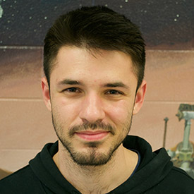

---
# Feel free to add content and custom Front Matter to this file.
# To modify the layout, see https://jekyllrb.com/docs/themes/#overriding-theme-defaults
layout: page
---

I am currently an AI researcher at Samsung Research, working on multimodal retrival and composed image search. 
I have completed my Ph.D. with the <a href="www.starslab.ca">STARS</a> lab at the University of Toronto, directed by Prof. <a href="http://stars.utias.utoronto.ca/~jkelly/">Jonathan Kelly</a>. During this time I was jointly affiliated with <a href="https://lamor.fer.hr/lamor">LAMOR</a> at the University of Zagreb, directed by Prof. Ivan Petrović.

During my graduate studies, my research endeavors focused on the application of methods derived from computational <a href="https://en.wikipedia.org/wiki/Differential_geometry">differential</a> and <a href="https://en.wikipedia.org/wiki/Algebraic_geometry">algebraic</a> geometry in the realms of inverse kinematics, motion planning and control for robotic manipulators.
Further, I am interested in how geometric representations can be used to inject domain-specific knowledge into learning methods for robotics.
If you're interested in my work, check out the <a href="/publications">publications</a> page for a list of papers and related resources. For code samples and libraries, please visit my <a href="https://github.com/filipmrc">github</a> profile.

<h4 style="margin-bottom:1rem;"> News and Updates</h4>

***

**[February, 2023]** Started position as AI research scientist at Samsung AI Montreal.

**[September, 2022]** Finished a 4 month long research scientist internship at Meta Reality Labs, San Francisco. My research involved learning kinematics for body tracking in VR.

**[October, 2021]** Our paper, "Riemannian Optimization for Distance Geometric Inverse Kinematics", has been accepted for publication with the IEEE Transactions on Robotics journal. The pre-print is available [here](https://arxiv.org/abs/2108.13720)!

**[June, 2021]** I'm honored to have been an invited speaker at this year's Robotics: Science and Systems (RSS) conference workshop "Geometry and Topology in Robotics: Learning, Optimization, Planning, and Control". Check out the video [here](https://youtu.be/uFe2oI6d-rg)!

**[October, 2020]** Our paper "Inverse Kinematics as Low-Rank Euclidean Distance Matrix Completion" won the best paper award at IROS’20 [Workshop on Bringing Geometric Methods to Robot Learning](https://sites.google.com/view/iros2020-geometric-methods/home)!

**[October, 2020]** Finally submitted our paper "Riemannian Optimization for Distance Geometric Inverse Kinematics" for publication in IEEE Transactions on Robotics.

**[August, 2020]** Submitted my paper "Geometry-Aware Singularity Avoidance for Articulated Robots Using a Riemannian Metric" for publication in Robotics and Autonomous Systems.

